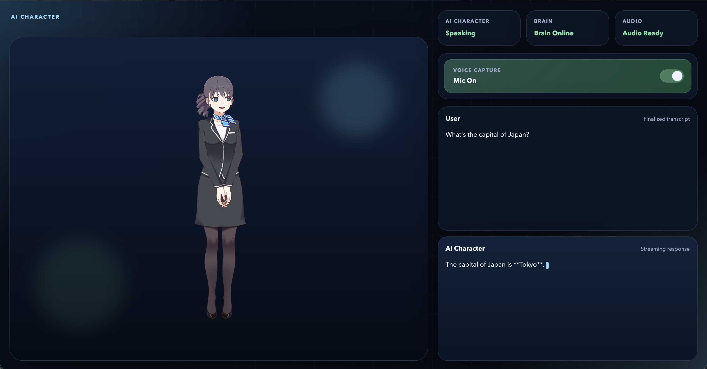

# AI Character

Real-time voice AI assistant that runs on local models, with a Live2D frontend and FastAPI websocket backend.

## Screenshot

## Project Layout

- [`backend/`](backend/README.md) contains the FastAPI app, websocket session handling, and the MLX-based speech/LLM/TTS pipeline.
- [`frontend/`](frontend/README.md) contains the browser client, Live2D assets, and bundled runtime libraries.
- [`frontend/src/`](frontend/src/README.md) contains the app's first-party JavaScript modules.
- [`frontend/lib/`](frontend/lib/README.md) contains bundled third-party browser libraries used by the Live2D client.
- `tests/` contains backend-focused test coverage for the pipeline and websocket session behavior.

## Prerequisites

- Python `3.12`
- `uv` package manager
- macOS (Apple Silicon recommended, since the backend uses `mlx-*` models/runtime)

## Setup

1. Install dependencies:
   - `uv sync --dev`
2. Create backend config:
   - `cp backend/config.yaml.example backend/config.yaml`
3. Configure frontend character (optional):
   - Edit `frontend/src/model-config.js` to change the Live2D model paths or adjust motion/expression mappings.
4. Set the STT, LLM, and TTS model paths referenced by `backend/config.yaml`.
   - Developed and tested with **Whisper Large v3 Turbo** (STT), **Qwen 2.5 7B MLX 4-bit** (LLM), and **Kokoro 82M BF16** (TTS).
5. Optional: configure any MCP servers you want to use. The example config includes SearXNG for web search.

This project is designed around local STT, LLM, and TTS models, with the backend using MLX for a macOS-friendly runtime.

## Run Locally

1. Start the app:
   - `uv run python backend/main.py`
2. Open:
   - `http://localhost:8100/client/index.html`

The backend serves the frontend assets directly, so one server process is enough for local development.

## What You Should See

- The app page loads at `http://localhost:8100/client/index.html`.
- The UI should show the brain as online once the websocket connects.
- On first mic use, the browser will ask for microphone permission.
- After you speak and pause, your finalized transcript should appear, followed by the streamed character response and audio playback.

## Architecture Overview

- The browser captures microphone audio and converts it to `Int16` PCM in `frontend/pcm-worklet.js`.
- The frontend sends PCM chunks to `backend/main.py` over a websocket at `/ws`.
- `backend/session.py` buffers audio, detects end-of-speech, and hands finalized turns to `backend/pipeline.py`.
- `backend/pipeline.py` runs speech-to-text, LLM generation, optional MCP tool use, and text-to-speech.
 The server streams conversation state updates, emotion tags (e.g., `[happy]`, `[angry]`) parsed from the LLM response, and WAV audio back to the client. The client maps these tags to specific model expressions/motions while `frontend/src/tts-playback-queue.js` handles audio and lip-sync.

## Development Commands

- Lint: `uv run ruff check .`
- Format check: `uv run ruff format --check .`
- Type-check: `uv run mypy`
- Tests: `uv run pytest`
- Run all quality gates: `make validate`

## Tests

- `tests/test_session.py` covers websocket session state transitions and client-control handling.
- `tests/test_pipeline.py` covers selected pipeline behavior without loading the full production models.

## Dependency Management

`pyproject.toml` is the source of truth for dependencies.

- Sync the environment from lock/manifest: `uv sync --dev`
- Regenerate `requirements.txt` when needed:
  - `./scripts/sync_requirements.sh`

## Troubleshooting

- If websocket is offline in UI, verify backend is running on `localhost:8100`.
- If microphone streaming fails, confirm browser mic permission is granted.
- If model loading fails, verify files under `frontend/models/Haru`.
- If character motions or expressions seem incorrect, check the mappings in `frontend/src/model-config.js`.
- If the app fails during startup, confirm `backend/config.yaml` exists and its referenced model paths and environment variables are valid.
- If startup hangs or fails while loading AI components, remember that `backend/pipeline.py` eagerly loads STT, LLM, and TTS models at process start.
- If MCP tool integration fails, confirm the configured external service and command in `backend/config.yaml` are available on your machine.

## Attribution

- Live2D runtime and model assets used by the frontend come from the [Live2D Cubism SDK ecosystem](https://www.live2d.com/en/sdk/about/).
- The frontend uses the [GitHub project `untitled-pixi-live2d-engine`](https://github.com/Untitled-Story/untitled-pixi-live2d-engine) to bridge PixiJS with Live2D model loading, animation, expressions, and lip sync.
- Bundled frontend library provenance is documented in [`frontend/lib/README.md`](frontend/lib/README.md).
- Third-party licensing and notice summary is documented in [`THIRD_PARTY_NOTICES.md`](THIRD_PARTY_NOTICES.md).
